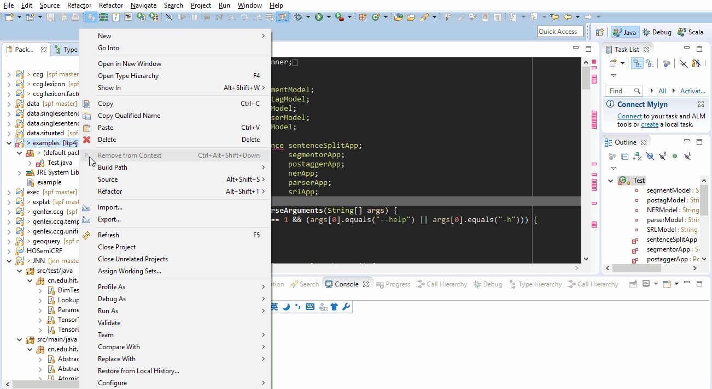

运行
====

以编译运行examples/Test.java为例。

概念
~~~~

**version与aol**

version是当前ltp4j的版本号，aol是使用ltp4j机器的`架构-系统-链接器`

在命令行条件下可以用如下命令获得

.. code:: shell

    # get version
    version=`egrep '<version>' pom.xml | head -1 | tr -d ' ' | sed 's/<version>//g' | sed 's/<\/version>//g'`
    
    # get aol
    aol=`ls target/ltp4j-${version}-*-jni.nar | sed "s/target\/ltp4j-${version}-//g" | sed "s/-jni.nar//g"`

    
在其他条件下可以根据编译步骤生成的的nar文件进行判断。
具体来讲编译步骤生成的nar文件的格式为`target/ltp4j-${version}-${aol}-jni.jar`。

**运行jni的必要条件**

1. 添加ltp4j.jar到java项目的classpath里
2. 添加c++代理程序的路径到java.library.path里

命令行
~~~~~~

.. code:: shell

    # get version
    version=`egrep '<version>' pom.xml | head -1 | tr -d ' ' | sed 's/<version>//g' | sed 's/<\/version>//g'`
    
    # get aol
    aol=`ls target/ltp4j-${version}-*-jni.nar | sed "s/target\/ltp4j-${version}-//g" | sed "s/-jni.nar//g"`

    # compile
    javac -cp "target/ltp4j-${version}.jar" examples/Test.java
    
    # run, specifying java.library.path, Test accept input from stdin
    cat examples/example | java -Djava.library.path=target/nar/ltp4j-$version-$aol-jni/lib/$aol/jni/ \
    -cp "target/ltp4j-${version}.jar:examples" Test \
    --segment-model=ltp_data/cws.model \
    --postag-model=ltp_data/pos.model \
    --ner-model=ltp_data/ner.model \
    --parser-model=ltp_data/parser.model \
    --srl-dir=ltp_data/srl/

Eclipse
~~~~~~~

1. File -> New -> Java Project, 在Project name处填入ltp4jtest
2. 右键examples项目下的src文件夹，在弹出菜单下选择New -> Class，Name处填入Test
3. 将examples/Test.java填入Test中
4. 右键examples项目下的Properties，
 1. 选择 `Java Build Path`
 2. 选择 `Libraries` 选项卡
 3. 选择 `Add External JAR...` 选择编译出的ltp4j-$version.jar文件 [添加ltp4.jar]
 4. 点击 > 箭头展开添加的ltp4j-$version.jar，在Native library location中选择C++代理程序的路径 [添加java.library.path]

如图所示：

 
参考： `How to set the java.library.path from Eclipse <http://stackoverflow.com/questions/957700/how-to-set-the-java-library-path-from-eclipse>`_

Intellij
~~~~~~~~

参考：`How to set the java.library.path in intelliJ Idea <http://stackoverflow.com/questions/19308010/how-to-set-the-java-library-path-in-intellij-idea>`_

常见问题
~~~~~~~~

